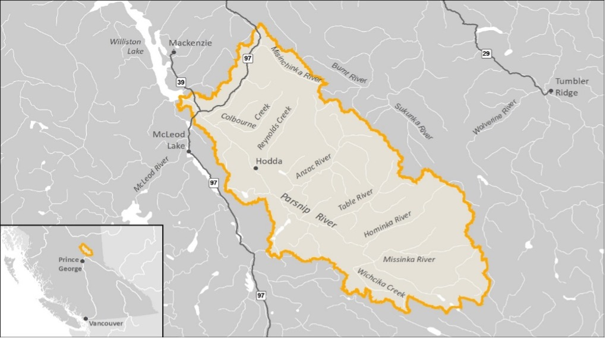
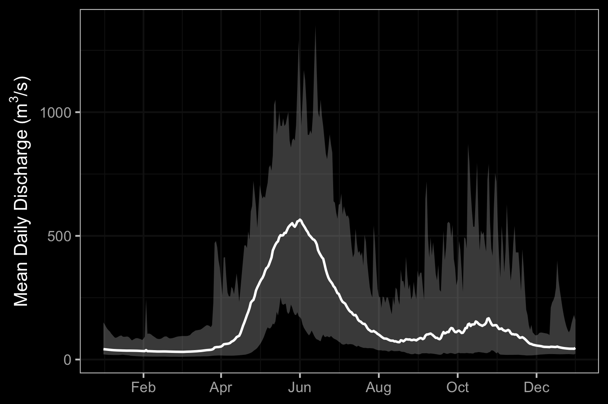

--- 
title: "PEA-F22-F-3577-DCA Restoring Fish Passage in the Peace Region"
author: |
 |
 | Prepared for
 | Fish and Wildlife Compensation Program  
 | Fish Passage Technical Working Group 
 |
 | Prepared by
 | Al Irvine, B.Sc., R.P.Bio.
 | New Graph Environment Ltd.
 |
 | Prepared with financial support of the Fish and Wildlife Compensation Program on
 | behalf of its program partners BC Hydro, the Province of BC, Fisheries and Oceans
 | Canada, First Nations and Public Stakeholders.

date: |
 |
 | Version 0.0.1 `r format(Sys.Date(), "%Y-%m-%d")`
toc-title: Table of Contents
site: bookdown::bookdown_site
output: 
  bookdown::gitbook:
          includes:
            in_header: header.html
nocite: |

documentclass: book
bibliography: [book.bib, packages.bib, references.bib]
biblio-style: apalike
link-citations: no
github-repo: rstudio/bookdown-demo
description: "My Description."


---

```{r switch-gitbook-html, echo=FALSE}
gitbook_on <- TRUE
# gitbook_on <- FALSE  ##we just need turn  this on and off to switch between gitbook and pdf via paged.js

```

```{r setup, echo=identical(gitbook_on, TRUE), include = TRUE}
knitr::opts_chunk$set(echo=identical(gitbook_on, TRUE), message=FALSE, warning=FALSE, dpi=60, out.width = "100%")
# knitr::knit_hooks$set(webgl = hook_webgl)
options(scipen=999)
options(knitr.kable.NA = '--') #'--'
options(knitr.kable.NAN = '--')
```

```{r settings-gitbook, eval= gitbook_on}
photo_width <- "100%"
font_set <- 11

```

```{r settings-paged-html, eval= identical(gitbook_on, FALSE)}
photo_width <- "80%"
font_set <- 9
```


```{r}
source('scripts/packages.R')
source('scripts/functions.R')
source('scripts/private_info.R')

```


```{r include=FALSE}
# automatically create a bib database for R packages
knitr::write_bib(c(
  .packages(), 'bookdown', 'knitr', 'rmarkdown'
), 'packages.bib')
```

# Acknowledgement {.front-matter .unnumbered}


Modern civilization has a long journey ahead to acknowledge and address the historic and ongoing impacts of colonialism that have resulted in harm to the cultures and livelihoods living interconnected with our ecosystems for many thousands of years. 
<br>

Many thanks to the McLeod Lake members of council that took the time to meet and discuss big picture goals for this collaboration. Than you to Nathan Prince for viewing sites in the field, liaising with numerous players and tying this work together with the numerous other initiatives the Nation is advising and steering.


```{js, logo-header, echo = FALSE, eval= T}
title=document.getElementById('header');
title.innerHTML = '' + title.innerHTML
```


<!--chapter:end:index.Rmd-->


# Executive Summary {-}

<!--chapter:end:0090-executive-summary.Rmd-->


# Introduction {-}

`r if(identical(gitbook_on, FALSE))knitr::asis_output("This report is available as pdf and as an online [interactive report](https://newgraphenvironment.github.io/fish_passage_parsnip_2021_reporting/) at https://newgraphenvironment.github.io/fish_passage_parsnip_2021_reporting/. We recommend viewing online as the web-hosted version contains more features and is more easily navigable. Please reference the website for the latest version number and download the latest pdf from https://github.com/NewGraphEnvironment/fish_passage_parsnip_2021_reporting/raw/master/docs/parsnip2021.pdf")` 

`r if(identical(gitbook_on, FALSE)){knitr::asis_output("<br>")}`


This project builds on Society for Ecosystem Restoration Northern BC (SERNbc) work in 2019 - 2020 which can be referenced [here](https://newgraphenvironment.github.io/Parsnip_Fish_Passage/) [@irvine2020ParsnipRiver]. In 2019, following a literature review, analysis of fish habitat modelling data, the Provincial Stream Crossing Inventory System (PSCIS) and a community scoping exercise within the McLeod Lake Indian Band habitat confirmation assessments were conducted throughout the Parsnip River watershed. At 17 sites where habitat confirmation assessments were conducted, crossings were rated for fish passage remediation priority. During the habitat confirmations a total of approximately 15 km of stream was assessed with 10 crossings rated as high priorities for rehabilitation, three crossings rated as moderate priorities and four crossings rated as low priorities.

<br>

The health and viability of freshwater fish populations can depend on access to tributary and off channel areas which provide refuge during high flows, opportunities for foraging, overwintering habitat, spawning habitat and summer rearing habitat [@Bramblett_2002; @swalesRoleOffChannelPonds1989; @diebel_etal2015EffectsRoad].  Culverts can present barriers to fish migration due to low water depth, increased water velocity, turbulence, a vertical drop at the culvert outlet and/or maintenance issues [@slaneyFishHabitatRehabilitation1997; @cote_etal2005Fishpassage]. As road crossing structures are commonly upgraded or removed there are numerous opportunities to restore connectivity by ensuring that fish passage considerations are incorporated into repair, replacement, relocation and deactivation designs. 

<br>

SERNbc is working together with the Peace Region Fish and Wildlife Compensation Program (FWCP), the McLeod Lake Indian Band, the Provincial Fish Passage Technical Working Group (FPTWG), road/rail tenure holders and other FWCP stakeholders/partners to prioritize, plan and fund the restoration of fish passage at Parsnip River watershed road crossing structure barriers previously ranked as high or moderate priorities. In 2021/2022 we were able to source funding from the Ministry of Forests, Lands and Natural Resource Operations and Rural Development to initiate replacement of a high priority crossing in the Missinka River watershed with a clearspan bridge.  With support from FWCP in 2023 remediation of fish passage at the site will be completed and works at an additional high priority site (Chuchinka-Arctic FSR) will be initiated. Additionally, through the ongoing development of open source analysis and data presentation tools we are identifying and highlighting sites with potential connectivity issues and are planning on the ground works to assess opportunities.  Planning, field assessments and follow up reporting will continue to include engagement with road/rail tenure holders, build awareness for connectivity issues in the wider community and build capacity for ecosystem restoration in the Peace Region.  


<!--chapter:end:0100-intro.Rmd-->


# Goal and Objectives {-}

The project engages FWCP partners and stakeholders to clearly communicate fish passage issues in the Parsnip River watershed while collaboratively planning and executing the steps necessary to realize fish passage restorations. Work completed and ongoing aligns with the Fish and Wildlife Compensation Program Rivers, Lakes and Reservoirs Action Plan [@fishandwildlifecompensationprogram2020PeaceRegion] sub objective 6 of addressing fish passage issues in streams to enhance productivity of priority species.  Project activities undertaken coincide with the following actions:

  * PEA.RLR.S06.RI.20 - Conducting engagement to prioritize options for fish passage improvement-P1 
  * PEA.RLR.S06.RI.19 - Conducting research to prioritize fish passage actions-P1
  * PEA.RLR.S06.HB.21 - Restoring fish access to streams-P1

<!--chapter:end:0150-goals_objectives.Rmd-->


# Study Area and Background {-}

## Tse'khene {-}

The Parsnip River watershed is located within the south-eastern portion of the 108,000 km^2^ traditional territory of the Tse'khene from the [McLeod Lake Indian Band](https://www.mlib.ca/about/History). The Tse'khene *"People of the Rocks"* are a south westerly extension of the Athabascan speaking people of northern Canada.  They were nomadic hunters whose language belongs to the Beaver-Sarcee-Tse'khene branch of Athapaskan [@HistoryWhoWeAre].  Extensive work is underway to preserve the language with resources such as First Voices available [online](https://www.firstvoices.com/explore/FV/sections/Data/Athabascan/Tse'Khene%20(McLeod%20Lake)/Tse'Khene%20(McLeod%20Lake)/learn) and in [app form](https://apps.apple.com/us/app/tsekhene-mcleod-lake/id1503929250) for iphone and ipad devices [@firstpeopleculturalcouncil2022LearnTse; @firstpeoplesheritagelanguageandculturecouncil2022TseKhene].

<br>

The continental divide separates watersheds flowing north into the Arctic Ocean via the Mackenzie River and south and west into the Pacific Ocean via the Fraser River (Figure \@ref(fig:overview-map)). The Parsnip River is a 6th order stream with a watershed that drains an area of 5597km^2^. The mainstem of the river flows within the Rocky Mountain Trench in a north direction into Williston Reservoir starting from the continental divide adjacent to Arctic Lakes. Major tributaries include the Misinchinka, Colbourne, Reynolds, Anzac, Table, Hominka and Missinka sub-basins which drain the western slopes of the Hart Ranges of the Rocky Mountains.  The Parsnip River has a mean annual discharge of `r round(fasstr::calc_longterm_mean(station_number = "07EE007")$LTMAD,1)` m^3^/s with flow patterns typical of high elevation watersheds on the west side of the northern Rocky Mountains which receive large amounts of precipitation as snow leading to peak levels of discharge during snowmelt, typically from May to July (Figures \@ref(fig:fig-hydrology-plot-flow) - \@ref(fig:fig-hydrology-plot-stats)).

<br>

Construction of the 183 m high and 2134 m long W.A.C. Bennett Dam was completed in 1967 at Hudson's Hope, BC, creating the Williston Reservoir [@hirst1991Impactsoperations]. Filling of the 375km^2^ reservoir was complete in 1972 and flooded a substantial portion of the Parsnip River and major tributary valleys forming what is now known as the Peace and Parsnip reaches. The replacement of riverine habitat with an inundated reservoir environment resulted in profound changes to the ecology, resource use and human settlement patterns in these systems [@hagen_etal2015Criticalhabitats; @pearce2019FirstNations; @stamford_etal2017FWCPArctic]. Prior to the filling of the reservoir, the Pack River, into which McLeod Lake flows, was a major tributary to the Parsnip River.  The Pack River currently enters the Williston Reservoir directly as the historic location of the confluence of the two rivers lies within the reservoir's footprint.

<br>


```{r overview-map, fig.cap = 'Overview map of study area',eval=T}

```

<br>


```{r fig-hydrology-plot-flow, eval = T, fig.dim = c(5.1, 3.4), fig.cap='Parsnip River Above Misinchinka River (Station #07EE007 - Lat 55.08194 Lon -122.913063). Available daily discharge data from 1967 to 2019.'}
# knitr::include_graphics("fig/hydrology1-1.png")  ##left this here in case we want to go back to having this build from scratch.

# img <- png::readPNG("fig/hydrology1.png")
# grid::grid.raster(img)



```

<br>

```{r fig-hydrology-plot-stats, fig.dim = c(5.1, 3.4), fig.cap="Summary discharge statistics (annual maximum, minimum, mean and standard deviation) for Parsnip River at hydrometric station #07EE007."}
# img <- png::readPNG("fig/hydrology2.png")
# grid::grid.raster(img)

knitr::include_graphics("fig/hydrology_stats_07EE007.png")
```

## Fisheries {-}
Fish species recorded in the Parsnip River watershed are detailed in Table \@ref(tab:table-fish) [@data_fish_obs]. In addition to flooding related to the formation of the Williston Reservoir, transmission lines, gas pipelines, rail, road networks, forestry, elevated water temperatures, interrupted connectivity, invasion from non-native species and insect infestations affecting forested areas pose threats to fisheries values in the Parsnip River watershed  [@hagen_2015_critical_habs; @stamfordFWCPArcticGrayling; @bull_trout_synthesis; @bt_cosewic]. A brief summary of trends and knowledge status related to Arctic grayling, bull trout, kokanee, mountain whitefish and rainbow trout in Williston Watershed streams is provided in @fishandwildlifecompensationprogram2020PeaceRegion with a more detailed review of the state of knowledge for Parsnip River watershed populations of Arctic grayling and bull trout provided below.

<br>


```{r fiss-species-table}
fiss_species_table <- readr::read_csv(paste0(getwd(), '/data/inputs_extracted/fiss_species_table.csv'))

fiss_species_table %>% 
  fpr::fpr_kable(caption_text = 'Fish species recorded in the Parsnip River watershed group.', scroll = gitbook_on)

```


### Bull Trout {-}

Bull Trout populations of the Williston Reservoir watershed are included within the Western Arctic population 'Designatable Unit 10', which, in 2012, received a ranking of ‘Special Concern’ by the Committee on the Status of Endangered Wildlife in Canada [@cosewic2012COSEWICassessment].  They were added to Schedule 1 under the Species of Risk Act in 2019  [@speciesregistrycanada2020BullTrout] and are also considered of special concern (blue-listed) provincially [@bcspeciesecosystemexplorer2020Salvelinusconfluentus]. Some or all of the long-term foot survey index sections of four Williston Reservoir spawning tributaries (Davis Creek, Misinchinka River, Point Creek, and Scott Creek), have been surveyed within 16 of the 19 years between 2001 and 2019 (16 of 19 in Davis River, 10 years over a 13-year period in the Misinchinka River, 11 years over a 14-year period for Point Creek, and 9 years over an 11-year period for Scott Creek [@hagen_etal2020CriticalSpawning]. 

<br>

A study of bull trout critical habitats in the Parsnip River was conducted in 2014 with the Misinchinka and Anzac systems identified as the most important systems for large bodied bull trout spawners accounting for a combined total of 65% of spawners counted.  The Table River was also highlighted as an important spawning destination accounting for an estimated 15% of the spawners.  Other watersheds identified as containing runs of large bodied bull troutspawners included the Colbourne, Reynolds, Hominka and Missinka River with potentially less than 50 spawners utilizing each sub-basin [@hagen_etal2015Criticalhabitats].  @hagen_weber2019Limitingfactors have synthesized a large body of information regarding limiting factors, enhancement potential, critical habitats and conservation status for bull trout of the Williston Reservoir and the reader is encouraged to review this work for context.  They have recommended experimental enhancements within a monitoring framework for Williston Reservoir bull trout (some spawning and rearing in Parsnip River mainstem and tributaries) which include stream fertilization, side channel development, riparian restoration and fish access improvement.  

<br>

In 2018, sub-basins of the Anzac River watershed, Homininka River, Missinka River and Table River watersheds were designated as fisheries sensitive watersheds under the authority of the *Forest and Range Practices Act* due to significant downstream fisheries values and significant watershed sensitivity [@anzac_sens; @hominka_sens; @table_sens; @missinka_sens]. Special management is required in these watersheds to protect habitat for fish species including bull trout and Arctic grayling including measures (among others) to limit equivalent clearcut area, reduce impacts to natural stream channel morphology, retain old growth attributes and maintain fish habitat/movement [@fsw_order].    

<br>

Tse'khene Elders from the McLeod Lake Indian Band report that sa'ba (bull trout) size and abundance has decreased in all rivers and tributaries from the reservoir with more injured and diseased fish captured in recent history than was common in the past [@pearce2019FirstNations]. 

<br>

### Arctic Grayling {-}
A detailed review of Arctic grayling life history can be referenced in @stamfordFWCPArcticGrayling. Since impoundment of the Williston Reservoir, it appears that physical habitat and ecological changes have been the most significant factors limiting Arctic grayling productivity. Although these changes are not well understood they have likely resulted in the inundation of key low gradient juvenile rearing and overwintering habitats, isolation of previously connected populations and increases in abundance of predators such as bull trout [@shrimptonj.m.GeneticAnalysisArctic2012; @hagenTrendAbundanceArctic2018].  

<br>

Migration of mature adult Arctic grayling occurs in the spring with arrival at known spawning locations coinciding with water temperatures of 4$^\circ$C.  Spawning in the Parsnip watershed appears to occur between late-May and late-June within sites located primarily within the lower reaches of the Anzac and Table rivers as well as within the Parsnip River mainstem. Side-channel and multiple-channel locations containing small gravels appear to be selected for spawning. Currently, the primary distribution of Williston Arctic grayling appears to be among fourth order and larger streams [@williamson_2004; @stamfordFWCPArcticGrayling]. @stewartFishLifeHistory2007 report that Arctic grayling spawn in large and small tributaries to rivers and lakes, intermittent streams, within mainstem rivers as well as lakes, most commonly at tributary mouths.   Although past study results indicate that 0+ grayling appeared to overwinter in lower reaches of larger tributaries (i.e. Table, Anzac rivers) as well as the Parsnip River and that few age-1+ grayling have been sampled in tributaries, habitat use in small tributaries and the extent they are connected with the mainstem habitats of all core areas is not well understood. Between 1995 and 2019, Arctic grayling population monitoring has been conducted in the Table River in nine out of 25 years (8 years for the Anzac) using snorkel surveys.  Results from 2018 are 2019 are intended to contribute to the assessment of the conservation status of the species in the Parsnip Core area [@hagenTrendAbundanceArctic2018].

<br>

Tse'khene Elders from the McLeod Lake Indian Band report that Arctic grayling numbers have declined dramatically since the flooding of the reservoir and that few dusk'ihje (Arctic Grayling) have been caught in the territory in the past 30 years [@pearce2019FirstNations].


<!--chapter:end:0200-background.Rmd-->


# Methods {-}

## Engagement {-}

From May 2021 to the time of reporting SERNbc and McLeod Lake staff have been actively engaging with the following groups to discuss the project, solicit input, prioritize sites and plan fish passage remediation.

  * McLeod Lake Indian Band members of council
  * BCTS Engineering
  * CN Rail
  * Canadian Forest Products (Canfor)
  * Sinclar Forest Projects Ltd. (Sinclar)
  * Northern Engineering - Forests, Lands, Natural Resource Operations and Rural Development (FLNR)
  * BC Ministry of Transportation and Infrastructure
  * Fish Passage Technical Working Group
  * Planning foresters and biologists Ministry of Forests, Lands, Natural Resource Operations and Rural Development (restructured into Ministry of Forests and Ministry of Land, Water and Resource Stewardship)
  *  Fisheries experts
   


### Environmental Stewardship Initiative {-}

The [Environmental Stewardship Initiative](https://www2.gov.bc.ca/gov/content/environment/natural-resource-stewardship/consulting-with-first-nations/collaborative-stewardship-bc/environmental-stewardship-initiative)(ESI) is a collaborative partnership between the Province and First Nations with projects designed to focus on ecosystem assessment, restoration, enhancement, research and education . To date, four regional environmental stewardship projects have been developed. A governance working group with representatives from all four stewardship forums provides governance oversight and guidance for the ESI. The Parsnip River watershed group is within the Regional Strategic Environmental Assessment Forum (RSEA) area.

<br>

Working together with McLeod Lake Indian Band we are leveraging RSEA initiatives by overlaying Parsnip River watershed group fish passage planning data with the [Recreational Opportunity Spectrum Inventory data](https://catalogue.data.gov.bc.ca/dataset/recreational-opportunity-spectrum-inventory) to facilitate discussions with partners and stakeholders about how long term landscape stewardship goals of McLeod Lake Indian Band relate to stream crossing infrastructure upgrades/removals within their traditional territory.  The inventory data summarizes recreation opportunities as combinations of settings and probable human experience opportunities organized along a spectrum of classes. The spectrum is set out in terms of seven classes as follows: Primitive (P), Semi-primitive Non-motorized (SPNM), Semi-primitive Motorized (SPM), Roaded Natural (RN), Roaded Modified (RM), Rural (R), Urban (U).  The general idea is that areas towards the primitive end of the spectrum provide more opportunities for First Nations groups such as the McLeod Lake Indian Band to exercise their rights as indigenous people in pristine areas within their traditional territory [@unitednationsgeneralassembly2007UnitedNations].


## Habitat Modelling {-}

Through this initiative as well as other SERNbc led initiatives [@irvine2021BulkleyRiver; @irvine2022BulkleyRiver], as well as through direction from the Provincial Fish Passage Remediation Program and connectivity restoration planning conducted by Canadian Wildlife Federation and others [@mazany-wright_etal2021BulkleyRiver; @irvine2022ElkRiver], `bcfishpass` has been designed to prioritize potential fish passage barriers for assessment or remediation. The software is under continual development and has been designed and constructed by @norris2021smnorrisbcfishpass using of sql and python based shell script libraries to generate a simple model of aquatic habitat connectivity.  The model identifies natural barriers (ex. steep gradients for extended distances) and hydroelectric dams to classifying the accessibility upstream by fish [@norris2021smnorrisbcfishpass]. On potentially accessible streams, scripts identify known barriers (ex. waterfalls >5m high) and additional anthropogenic features which are primarily road/railway stream crossings (i.e. culverts) that are potentially barriers. To prioritize these features for assessment or remediation, scripts report on how much modelled potentially accessible aquatic habitat the barriers may obstruct. The model can be refined with known fish observations upstream of identified barriers and for each crossing location, the area of lake and wetland habitat upstream, species documented upstream/downstream, an estimate of watershed area (on 2nd order and higher streams), mean annual precipitation weighted to upstream watershed area and channel width can be collated using `bcfishpass`, `fwapg` and `bcfishobs`.  This, information, can be used to provide an indication of the potential quantity and quality of habitat potentially gained should fish passage be restored by comparing to user defined thresholds for the aforementioned parameters. 
 
 <br>
 
 `bcfishpass` calculates the average gradient of BC Freshwater Atlas stream network lines at minimum 100m long intervals starting from the downstream end of the streamline segment and working upstream.  The network lines are broken into max gradient categories with new segments created if and when the average slope of the stream line segment exceeds user provided thresholds. For this project, the user provided gradient thresholds used to delineate "potentially accessible habitat" were based on estimated max gradients that rainbow trout (20%) and bull trout (25%) are likely to be capable of ascending.  

<br>

Gradient, channel size and stream discharge are key determinants of channel morphology and subsequently fish distribution. High value  rearing, overwintering  and spawning habitat preferred by numerous species/life stages of fish are often located within channel types that have relatively low gradients and large channel widths (also quantified by the amount of flow in the stream).  Following delineation of "potentially accessible habitat", the average gradient of each stream segment within habitat classified as below the 20% and 25% thresholds was calculated and summed within species and life stage specific gradient categories.  Average gradient of stream line segments can be calculated from elevations contained in the provincial freshwater atlas streamline dataset. To obtain estimates of channel width upstream of crossing locations, where available, `bcfishpass` was utilized to pull average channel gradients from Fisheries Information Summary System (FISS) site assessment data [@moeStreamInventorySample] or PSCIS assessment data [@moe2021PSCISAssessments] and associate with stream segment lines. When both FISS and PSCIS values were associated with a particular stream segment, FISS channel width was used.  When multiple FISS sites were associated with a particular stream segment a mean of the average channel widths was taken.  To model channel width for 2nd order and above stream segments without associated FISS or PSCIS sites, first `fwapg` was used to estimate the drainage area upstream of the segment.  Then, rasters from ClimateBC [@wang_etal2012ClimateWNAHighResolution] were sampled for upstream watershed areas associated with each stream segment and a mean annual precipitation weighted by upstream watershed area was calculated. This data was used to model channel width using Bayesian statistical methods analyzing the relationship between input variables (n = 24849).  The details of this analysis and resulting formula used to estimate channel width on stream segments is included as a technical appendix `r if(gitbook_on){knitr::asis_output("[here](https://www.poissonconsulting.ca/f/859859031)")} else knitr::asis_output("at https://www.poissonconsulting.ca/f/859859031")`. 

<br>

`bcfishpass` and associated tools have been designed to be flexible in analysis, accepting user defined gradient, channel width and stream discharge categories [@moeStreamInventorySample].  Although currently in draft form, and subject to development revisions, gradient and channel width thresholds for habitat with the highest intrinsic value for a number of fish species in the Parsnip River watershed group have been specified and applied to model habitat upstream of stream crossing locations with the highest potential intrinsic value (Table \@ref(tab:tab-fish-spawning-rearing)).  Thresholds were derived based on a literature review with references provided in Table \@ref(tab:tab-fish-spawning-rearing-references). Output parameters for modelling are presented in Table \@ref(tab:tab-bcfp-def).


`r if(gitbook_on){knitr::asis_output("<br>")} else knitr::asis_output("<br><br><br>")`


```{r tab-fish-spawning-rearing, eval=F}
#`r if(identical(gitbook_on, FALSE)){knitr::asis_output("<br><br><br>")}`
bcfishpass_spawn_rear_model %>% 
  mutate(Species = fishbc::fbc_common_name(species_code), 
         spawn_gradient_max = round(spawn_gradient_max * 100 ,1),
         rear_gradient_max = round(rear_gradient_max * 100 ,1)) %>%
  select(Species, 
         `Spawning Gradient  Max (%)`= spawn_gradient_max,
         `Spawning Width Min (m)` = spawn_channel_width_min,
         # `Spawning Width Max (m)` = spawn_channel_width_max,
         # `Spawning MAD Min (m3/s)` = spawn_mad_min,
         # `Spawning MAD Max (m3/s)` = spawn_mad_max,
         `Rearing Gradient Max (%)` = rear_gradient_max) %>% 
         # `Rearing MAD Min (m3/s)` = rear_mad_min,
         # `Rearing MAD Max (m3/s)` = rear_mad_max,
         # `Rearing Wetland Multiplier` = rear_wetland_multiplier,
         # `Rearing Lake Multiplier` = rear_lake_multiplier) %>% 
  t() %>% 
  as_tibble(rownames = "row_names") %>% 
  janitor::row_to_names(row_number = 1) %>% 
  rename(Variable = Species) %>% 
  fpr::fpr_kable(caption_text = 'Stream gradient and channel width thresholds used to model potentially highest value fish habitat.', scroll = F)

```

<br>

```{r tab-fish-spawning-rearing-references, eval = F}
# bcfishpass_spawn_rear_model_references <- readr::read_csv(file = 'data/width_modelling/model_spawning_rearing_habitat.csv')
bcfishpass_spawn_rear_model_references <- readr::read_csv(file = 'data/inputs_raw/model_spawning_rearing_habitat.csv') 
  # select(species_code, contains('ref'), -contains(c('multiplier','mad')))
  
bcfishpass_spawn_rear_model_references %>% 
  mutate(Species = fishbc::fbc_common_name(species_code)) %>% 
  select(Species, 
         `Spawning Gradient  Max (%)`= spawn_gradient_max,
         `Spawning Width Min (m)` = spawn_channel_width_min,
         # `Spawning Width Max (m)` = spawn_channel_width_max_ref,
         # `Spawning MAD Min (m3/s)` = spawn_mad_min,
         # `Spawning MAD Max (m3/s)` = spawn_mad_max,
         `Rearing Gradient Max (%)` = rear_gradient_max) %>% 
         # `Rearing Wetland Multiplier` = rear_wetland_multiplier,
         # `Rearing Lake Multiplier` = rear_lake_multiplier) %>% 
         # `Rearing MAD Min (m3/s)` = rear_mad_min,
         # `Rearing MAD Max (m3/s)` = rear_mad_max) %>% 
  t() %>% 
  as_tibble(rownames = "row_names") %>% 
  janitor::row_to_names(row_number = 1) %>% 
  rename(Variable = Species) %>% 
  fpr::fpr_kable(caption_text = 'References for stream gradient and channel width thresholds used to model potentially highest value fish habitat. Preliminary and subject to revisions.', scroll = F)
```


<br>

```{r tab-bcfp-def, eval = F}
xref_bcfishpass_names %>% 
  filter(id_side == 1) %>% 
  arrange(id_join) %>%  
  select(Attribute = report, Definition = column_comment) %>% 
  fpr::fpr_kable(caption_text = 'bcfishpass outputs and associated definitions',
                 footnote_text = 'Steelhead model uses a gradient threshold of maximum 20% to determine if access if likely possible',
                 scroll = gitbook_on)

```


## Online Mapping {-}

An online mapping portal was


<!--chapter:end:0300-methods.Rmd-->


# Results and Discussion {-}

## Partnership Funding {-}

SERN was able to aquire \$105,000 of partnership funding from FLNR (\$80,000) and the Provincial Fish Passage Technical Working Group (\$25,000) towards the 2021/2022 program. Additionally, we have obtained a commitment for \$25,000 of partnership funding from the the Provincial Fish Passage Technical Working Group towards the 2022/2023 program.


## Planned Remediations {-}

### PSCIS Crossing 125179 - Tributary to Missinka River

We are working together with McLeod Lake and Sinclar to advance crossing [125179 (Tributary to Missinka River)](https://newgraphenvironment.github.io/Parsnip_Fish_Passage/03_Parsnip_report_125179.html). Works to replace the crossing are planned for summer of 2022. A map of the watershed is provided in map attachment [093I.116](https://hillcrestgeo.ca/outgoing/fishpassage/projects/parsnip/FishPassage_093I.116.pdf).

<br>

Although this crossing is used to access an area of significant cultural value to McLeod Lake due to high recreational values [(unmotorized primitive)](https://catalogue.data.gov.bc.ca/dataset/recreational-opportunity-spectrum-inventory), and is located within a watershed where expansion of "unmotorized primitive" values will occur in the future through deactivation of roads and reforestation, this site was selected as appropriate for restoration for the following reasons:
   
      + At the time of reporting there was significant harvesting and silviculture obligations in areas accessed by the FSR.
      + The Missinka River watershed is designated as a fisheries sensitive watershed under the *Forest and Range Practices Act* [@beaudry2013Assessmentassignmenta] 
      + @hagen_etal2015Criticalhabitats have identified the Missinka River watershed as containing critical spawning and juvenile rearing habitat for large body adult sa'ba (bull trout) with potentially less than 50 spawners utilizing the watershed.
      + The Missinka River watershed is utilized by a possibly genetically distinct, self-sustaining dusk'ihje (Arctic grayling) population with the mainstem of the river providing critical habitat for fry and adult fish  
      + The subject tributary is documented as containing sa'ba.  
      + A bridge design was commissioned for the site in 2020 through funding from FWCP (project PEA-F20-F-2967) so preparations for replacement could be made in a timely fashion.  
      + $80,000 of partnership funding was acquired by SERNbc from FLNR to implement fish passage restoration at the site in 2022 according to the design aquired for the site in 2019/2020. Sinclar Forest Projects Ltd. is the road permit holder at this site and was awarded a contract to initiate delivery of the bridge installation. Sinclar will be sending out a request for proposals for the structure replacement to three qualified contractors soon in hopes to have a contract in place this winter so we can hit the ground running next summer.  Project coordination expertise by Sinclar are being provided in-kind.  The \$80,000 awarded to Sinclar by FLNR was spent on the following measures:
          - Water Sustainability Act Permit Application
          - Environmental Management Plan assessment and documentation
          - Source, purchase and mobilization of steel girders, modular timber deck and lock block abutment as per site design
          
          
Leveraging support from FWCP, Sinclar will obtain portions of the remaining funding for this work planned for the summer of 2022 through the forestry appraisal system.


### PSCIS 125000 - Tributary to Parsnip River {-}

We are working together with McLeod Lake and Sinclar to advance the replacement of crossing [125000 (Tributary to Parsnip River)](https://newgraphenvironment.github.io/Parsnip_Fish_Passage/03_Parsnip_report_125000.html) on the Chuchinka-Arctic FSR.  A map of the watershed is provided in map attachment  [093I.111](https://hillcrestgeo.ca/outgoing/fishpassage/projects/parsnip/FishPassage_093I.111.pdf).  The crossing was prioritized for restoration for the following reasons:
  
      + At the time of reporting there was significant harvesting and silviculture obligations in areas accessed by the FSR.
      + With an outlet drop of 40cm the culvert in place is a complete barrier to upstream fish passage with very low likelihood of any fish movement upstream.
      + The culvert in place is likely over 30 years old, is undersized and is at risk of washout.  A washout event would result in significant deposition of material downstream of the road and negative impacts on local fisheries values.  
      + The FSR accesses McLeod Lake reservation lands  (ID: Arctic Lake 10) located near the outlet of Arctic Lake.
      + This site is in the general vicinity of the outlet of Arctic Lake which has been identified as a high priority area for taloo'azi (kokanee) and sa'ba by participants in FWCP supported information gathering work [@pearce2019FirstNations].
      + The FSR accesses the Arctic Lake Provincial Park which has significant historic and recreational values.  A canoe launch area for the Parsnip River is also located at the upper Parsnip River Bridge.
      + There are no other stream crossing structures on the mainstem of this tributary that impede fish passage.
      + The stream has a large channel width at the crossing location (4.4m) and has an estimated 3.5km of mainstem habitat less than 5% gradient available upstream of the crossing with rainbow Trout and sculpin confirmed as present immediately below the crossing. Habitat was rated as high value for salmonid rearing and spawning in surveys conducted in 2019.


### PSCIS 125231 - Tributary to Table River {-}

We are working together with McLeod Lake and Canfor to advance crossing [125231 (Tributary to Table River)](https://newgraphenvironment.github.io/Parsnip_Fish_Passage/03_Parsnip_report_125231.html) on the Chuchinka-Table FSR for the following reasons:

      + Table River watershed is designated as a fisheries sensitive watershed under the authority of the *Forest and Range Practices Act* due to significant downstream fisheries values and watershed sensitivity [@beaudry2014Assessmentassignmenta]. Special management is required in the crossing’s watershed to protect habitat for sa'ba and dusk'ihje and includes measures (among others) to limit equivalent clearcut area, reduce impacts to natural stream channel morphology, retain old growth attributes and maintain fish habitat/movement.
      + @hagen_etal2015Criticalhabitats have identified the Table River watershed and several tributaries as containing critical spawning and juvenile rearing habitat for large body sa'ba with an estimated minimum spawner abundance of 100 fish.
      + The Table River (along with the Anzac River) is identified as the primary core of post-Williston dusk'ihje distribution in the Parsnip River watershed with life history, migration behaviours and critical habitats summarized in @hagen_etal2015Criticalhabitats. The mainstem of the Table River contains critical habitats for all life stages of dusk'ihje with adults observed moving among mainstem locations and tributaries during summer. 
      + The culvert in place is likely over 30 years old, is undersized and is at risk of washout.  A washout event would result in significant deposition of material downstream of the road and negative impacts on local fisheries values. 
      + The subject tributary is documented as containing rainbow trout with habitat present also suitable for sa'ba rearing and spawning.
      + At the time of reporting there was significant harvesting planned and silviculture obligations outstanding in areas accessed by the FSR.
      + With an outlet drop of 60cm, the culvert in place is a complete barrier to upstream fish passage with very low likelihood of any upstream fish migration.
      + There are no other stream crossing structures on the mainstem of this tributary that impede fish passage. There is a newly installed bridge upstream and the culvert under the CN railway downstream was considered passable according to the provincial protocol [@moe2011Fieldassessment].
      + The stream has a large channel width at the crossing location (4.0m) and has an estimated 875m habitat available upstream with average gradients mapped at less than 10%. Habitat was rated as high value for salmonid rearing and spawning in surveys conducted in 2019. 

### PSCIS 125345 - Tributary to Parsnip River

BCTS is planning to deactivate the Chuchinka-Colbourne FSR between where [125345 (Tributary to Parsnip River)](https://newgraphenvironment.github.io/Parsnip_Fish_Passage/03_Parsnip_report_125345.html) is located and the Chuckhinka-Anzac FSR to the south. The work is schedule for July and August of 2022.  BCTS was able to engage the Forest Carbon Initiative about the project, who has confirmed that they have funding available for a full road rehabilitation on this section and are able to fund the replanting and road decompaction. This full scale rehabilitation will provide more intensity towards re-vegetation and access management than traditional deactivation practices. We have been in contact with CN Rail to advocate for the removal of crossing 57687 located under the railway immediately upstream of the PSCIS crossing 125345 and the FSR. Discussions are ongoing and we are hopeful action will be taken by CN this summer to remediate crossing 57687 as well. 

## Habitat Modelling {-}


In December of 2021, Bayesian statistical methods were used to update our model of stream channel width based on a power model derived by @finnegan_etal2005Controlschannel which relates stream discharge to watershed area and mean annual precipitation. Data (n = 24849) on watershed size, mean annual precipitation and measured channel width was extracted from the provincial freshwater atlas [@flnrord2021FreshwaterAtlasb;  @geobc2022FreshwaterAtlas], the BC Data Catalouge fisheries datasets [@moe2020StreamInventory; @moe2021PSCISAssessments] and @wang_etal2012ClimateWNAHighResolution utilizing `bcfishpass` [@norris2021smnorrisbcfishpass] and `fwapg` [@norris2021smnorrisfwapg].  This data used to model channel width using Bayesian statistical methods analyzing the relationship between the input variables.  The details of this analysis and resulting formula are documented in @thorley_etal2021ChannelWidth and were used to estimate channel width of stream segments in the Parsnip River watershed to facilitate modelling of highest intrinsic fisheries habitat value.  The analysis is attached as a technical appendix `r if(gitbook_on){knitr::asis_output("[here](https://www.poissonconsulting.ca/f/859859031)")} else knitr::asis_output("at https://www.poissonconsulting.ca/f/859859031")`. 

<br>


We are leveraging this project together with numerous others to contributing to the open source development of [`bcfishpass`](https://github.com/smnorris/bcfishpass) and [`fwapg`](https://github.com/smnorris/fwapg) and using these database building and habitat/connectivity modeling tools to conduct reproducible analysis/presentation of fish passage restoration opportunities in the Parsnip River watershed in order to facilitate outreach, prioritize sites and provide the background information necessary to communicate restoration plans/actions effectively. 

<br>

Working with Ministry of Environment and Climate Change Strategy we have accessed historic electrofishing data for the entire province from British Columbia databases to begin developing evidence based approaches to modelling the highest value habitat for individual fish species.  This work is an important step to increasing our state of knowledge, informing our field data collection and data management protocols provincially as well as for informing fish passage restoration investment decisions and monitoring outcomes.  This work leverages many initiatives throughout the province and is briefly detailed [here](https://www.newgraphenvironment.com/fissr_explore/big-picture.html) with preliminary results presented as a digital attachment [here](https://www.poissonconsulting.ca/temporary-hidden-link/1386346791/fissr-explore-21/) [@amies-galonski_etal2022FISSFish].

<br>

## Fisheries {-}


Although it should not be assumed that all habitat types have been historically sampled equally, a review of available fisheries data for the Parsnip River watershed stratified by different habitat characteristics can provide insight into which habitats may provide the highest intrinsic value for fish species based on the number of fish captured in those habitats in past assessment work. Figures \@ref(fig:fish-plot-grad) - \@ref(fig:fish-plot-wshed).


```{r fish-fiss-summary, eval=T}
# fiss_sum <- readr::read_csv(file = paste0(getwd(), '/data/extracted_inputs/fiss_sum.csv'))
fiss_sum_grad <- readr::read_csv(file = paste0(getwd(), '/data/inputs_extracted/fiss_sum_grad.csv'))
fiss_sum_width <- readr::read_csv(file = paste0(getwd(), '/data/inputs_extracted/fiss_sum_width.csv'))
fiss_sum_wshed <- readr::read_csv(file = paste0(getwd(), '/data/inputs_extracted/fiss_sum_wshed.csv'))
# A summary of historical westslope cutthrout trout observations in the Elk River watershed group by average gradient category of associated stream segment is provided in Figure \@ref(fig:fish-wct-bar). Of `r wct_elkr_grad %>% filter(gradient_id == 3) %>% pull(total)` observations, `r wct_elkr_grad %>% filter(gradient_id == 3) %>% pull(Percent) + wct_elkr_grad %>% filter(gradient_id == 5) %>% pull(Percent) + wct_elkr_grad %>% filter(gradient_id == 8) %>% pull(Percent)`% were within stream segments with average gradients ranging from 0 - 8%.  A total of `r wct_elkr_grad %>% filter(gradient_id == 3) %>% pull(Percent)`% of historic observations were within stream segments with gradients between 0 - 3%, `r wct_elkr_grad %>% filter(gradient_id == 5) %>% pull(Percent)`% were within stream segments with gradients ranging from 3 - 5% and `r wct_elkr_grad %>% filter(gradient_id == 5) %>% pull(Percent)`% were within stream segments with gradients between 5 - 8% [@data_fish_obs; @norris2020bcfishobs]. 
```

```{r tab-fish-grad}
my_caption <- 'Summary of historic salmonid observations vs. stream gradient category for the Parsnip River watershed group.'
fiss_sum_grad %>% 
  select(-gradient_id) %>% 
  fpr::fpr_kable(caption_text = my_caption)
```

```{r fish-plot-grad, out.width = photo_width, fig.cap= 'Summary of historic salmonid observations vs. stream gradient category for the Parsnip River watershed group.', eval=T}
##bar graph
plot_grad <- fiss_sum_grad %>% 
  filter(gradient_id != 99) %>% 
  ggplot(aes(x = Gradient, y = Percent)) +
  geom_bar(stat = "identity")+
  facet_wrap(~species_code, ncol = 2)+
  ggdark::dark_theme_bw(base_size = 11)+
  labs(x = "Average Stream Gradient", y = "Occurrences (%)")
plot_grad

```

<br>

```{r tab-fish-width}
my_caption <- 'Summary of historic salmonid observations vs. channel width category for the Parsnip River watershed group.'
fiss_sum_width %>% 
  select(-width_id) %>% 
  fpr::fpr_kable(caption_text = my_caption)
```

<br>

```{r fish-plot-width, out.width = photo_width, fig.cap= 'Summary of historic salmonid observations vs. channel width category for the Parsnip River watershed group.', eval=T}
##bar graph
plot_width <- fiss_sum_width %>% 
  filter(!is.na(width_id)) %>%
  ggplot(aes(x = Width, y = Percent)) +
  geom_bar(stat = "identity")+
  facet_wrap(~species_code, ncol = 2)+
  ggdark::dark_theme_bw(base_size = 11)+
  labs(x = "Channel Width", y = "Occurrences (%)")
plot_width
```

<br>

```{r tab-fish-wshed}
my_caption <- 'Summary of historic salmonid observations vs. watershed size category for the Parsnip River watershed group.'
fiss_sum_wshed %>% 
  fpr::fpr_kable(caption_text = my_caption)
```


<br>

```{r fish-plot-wshed, out.width = photo_width, fig.cap= 'Summary of historic salmonid observations vs. watershed size category for the Parsnip River watershed group.', eval=T}
plot_wshed <- fiss_sum_wshed %>%
  filter(!is.na(upstream_area_ha)) %>%
  ggplot(aes(x = Watershed, y = Percent)) +
  geom_bar(stat = "identity")+
  facet_wrap(~species_code, ncol = 2)+
  ggdark::dark_theme_bw(base_size = 11)+
  labs(x = "Watershed Area", y = "Occurrences (%)")+
  theme(axis.text.x=element_text(angle = 45, hjust = 1))
plot_wshed
```

<!--chapter:end:0400-results.Rmd-->


# Recomendations{-}

A multi-year plan with one to two structure replacements (or removals) each year with works at each site phased over two years each is recommended.  This approach will facilitate progress at a minimum of one site per year and allows ample time for planning, coordination and funding acquisition related to each restoration. Multi-year planning allows an inclusive environment to solicit funding collaboration with the numerous potential partners and stakeholders in the watershed (i.e. Sinclar, Canfor, CN Rail, Coastal Gas Link, FLNR, fish passage technical working group, Ministry of Transportation and Infrastructure, McLeod Lake, Treaty 8 Nations, etc.).
 
 * In 2023/2024 we propose replacement of crossings where preparations were made in 2022/2023 in partnership with Sinclar.  Sinclar has committed to obtaining portions of the funding for this work through the forestry appraisal system and we will actively engage with partners and stakeholders to obtain other funding contributions.  Additionally, we propose preparations for structure replacement at an addition two sites that can be completed in the following fiscal.  This model of progress is proposed to continue through 2025/2026 fiscal.
 
 * In 2022/2023  we will work together with BCTS and other interested parties to rehabilitate and monitor the Chuchinka-Colbourne FSR where 125345 (Tributary to Parsnip River) will be removed and the road deactivated/decompacted and planted in 2022.  We will continue to engage with CN to advance remediation of passage at crossing 57687 located under the railway immediately upstream of this site.
 
  * We recommend continuing to engage FWCP partners and stakeholders to explore and clearly communicate fish passage issues in the Parsnip River watershed, build relationships and obtain partnership funding commitments while collaboratively prioritizing, planning and delivering fish passage restorations.
 
 * We recommend continuing to implement capacity building programs that will provide resources and skills for watershed stakeholders and partners to engage in watershed restoration planning activities and on the ground works as well as to monitor outcomes of project initiatives.  
 
 

<!--chapter:end:0500-recomendations.Rmd-->

`r if (knitr::is_html_output()){ '
# References {-}
<div id="refs"></div>
'}`

```{r}
#https://github.com/rstudio/bookdown/issues/8 how to put the references wherever we want.

# `r if (knitr::is_html_output()){ '
# # References {-}
# <div id="refs"></div>
# '}`
```


<!--chapter:end:2000-references.Rmd-->


# Session Info {-}


```{r session info, comment="", class.source = 'fold-show'}
xfun::session_info()
```

<!--chapter:end:2100-session-info.Rmd-->

